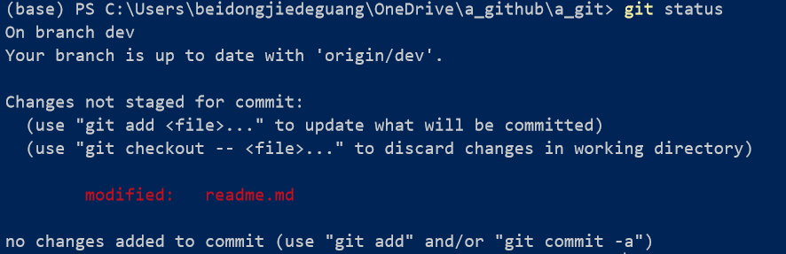
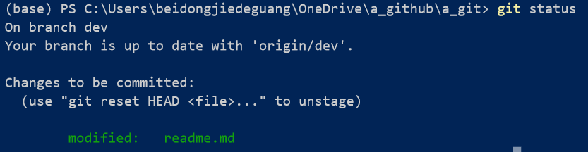
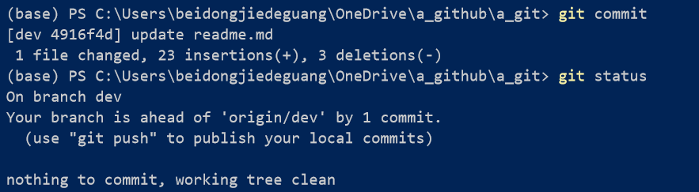

***

**dev** branch

***

counts commit : 8

#### 基础命令

`git status`	 :查看项目当前状态

* 文件的提交需要经过`git add`、`git commit`及`git push`三个过程才能提交至git远程仓库。

* 即`git add`提交至暂存区，再`git commit`提交至本地仓库，最后`git push`提交至远程仓库

而`git status`便可以看到暂存区和本地仓库的文件变动以及提交状态

例如，我在dev 分支下，更新了我的`readme.md`文件，此时我直接执行`git status`查看状态:



然后执行`git add .` 



再`git commit` 




```bash

git log 	# 查看commit 记录

```


**分支 branch**: 

比如我有个仓库在master主分支上面提交了 XXX1.0 版本，现在我想对其进行修改更新，但这需要一段时间，而我又需要即时push上去，以免本地出现问题，这时如果直接在master分支上做修改，将会让别人感到怪异，因为呈现的是个半成品。

所以此时可以新建一个dev分支，在这个分支里面进行代码更新、重构等操作

```bash
git branch 分支名 # 创建新分支
git checkout 分支名 # 切换到分支
git checkout -b 分支名 # 创建并切换到分支
```

而等到更新完成时，就可以将dev分支合并到master中，完成版本的更替

*（在终端切换分支时，本地文件也会对应切换）*

所以下面给出对以上的全部操作流程：

**合并 merge**

```bash
git checkout -b dev     # 新建并进入dev分支
git commit          	# 提交 
...						# 提交 n 次后
...						# 终于项目代码更新完成
git checkout master		# 切换到master分支
git commit				# 主分支可能需要在别处修改一些东西，提交
git merge dev			# 将dev合并到master

git checkout dev		
git merge master		# 此时master == dev，以待下一次的版本更新
```

另外一种合并方式是 **rebase**  

如现在我们有两个分支: dev 和 master , 它们已经各自修改提交了很多次，现在要合并它们：

```bash
git checkout dev
git rebase master   # 将dev上的工作直接移到 master分支后面

git checkout master
git rebase dev		# 更新master
```


**HEAD** 重点！！

我们每次在git上操作时，可以感受到其实是有一个指针指在我们操作的节点上，那就HEAD。

比如当我们处于master分支上时，HEAD就指向master所在节点

可以通过`git checkout dev` 让HEAD指向dev

当然它更重要的地方在于指向提交记录：

我们可以通过指定提交记录哈希值的方式让HEAD在git中移动，而哈希值通过`git log` 来查看，虽然哈希值很长，比如可能是fed2da64c0efc5293610bdd892f82a58e8cbc5d8 此时一般输入`git checkout fed2`就可以定位到该记录节点处。

but, 通过哈希值指定提交记录多数情况都很不方便，所以 Git 引入了相对引用。

* 使用 `^` 向上移动 1 个提交记录
* 使用 `~` 向上移动多个提交记录，如 `~3`

比如我想从master节点移动到dev节点的父节点：

```bash
git checkout dev^
```

移动至当前节点的3级父节点：

```bash
git checkout HEAD~3
```

来干点儿有用的吧

让master分支移动到3级父节点处：

```bash
git checkout master 	     # HEAD 移动到master节点上
git branch -f master HEAD~3  # 当前的HEAD向后3个节点， -f为强制移动分支
```

注：当使用git  branch -f 把master分支移动到某个节点后，又想移动回最新节点 ，可以使用：

  1. `git pull` 快速切换至最新

  2. `git log`查看最新节点的哈希值，然后 `git branch -f master xxx`

     

 **撤销变更** 

* `git reset` 通过把分支记录回退几个提交记录来实现撤销改动。你可以将这想象成“改写历史”。

  如将当前分支撤销到上一次的提交：`git reset HEAD^`  (这跟移动分支有啥区别，可能移动分支，节点还是保留的吧，这个节点就木有了)

  有时`reset`出错了，或者别的情况，需要恢复到reset之前的状态，便可以执行如下进行恢复：

  ```
  git reset --hard ORIG_HEAD
  ```

  `git reset`中有三个命令（--hard、--soft与--mixed），主要用于本地工作区、暂存区、本地仓库三个区域的文件提交撤回。

  其中：

  git reset : 可从暂存区撤回到本地工作区。

  git reset  --soft : 从本地仓库(commit之后的区域) 撤回 至 暂存区，即 reset only HEAD

  git reset --mixed : 从本地仓库 和 暂存区 都撤回至本地工作区, 即 reset  HEAD and index

  git reset --hard : 慎用！ 它会将这三个区域均撤回至指定节点，因为工作区的文件也会撤回，也就是文件将会直接删除。 即 reset HEAD, index and working tree


* 虽然在本地分支中使用 `git reset` 很方便，但是这种“改写历史”的方法对大家一起使用的远程分支是无效的哦！

  为了撤销更改并**分享**给别人，我们需要使用 `git revert`：

  


### ssh key:

```bash
Your identification has been saved in C:\Users\beidongjiedeguang/.ssh/id_rsa.
Your public key has been saved in C:\Users\beidongjiedeguang/.ssh/id_rsa.pub.
```


